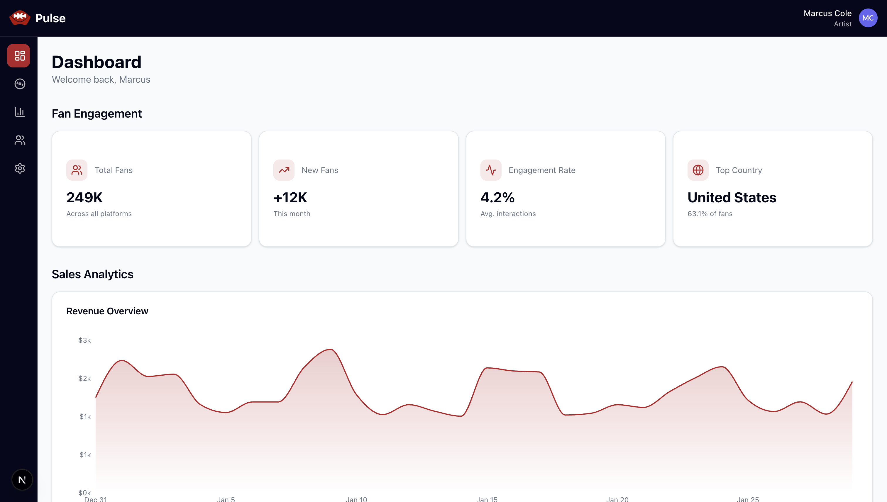

# Pulse - Music Artist Dashboard

A modern, responsive dashboard for music artists to track releases, sales analytics, and fan engagement metrics in real-time.



## 🌐 Live Demo

[View Live Demo](https://pulse-dashboard-nine.vercel.app/)
<!-- Deploy: vercel --prod, then update URL -->

---

## 🛠 Tech Stack & Justifications

| Technology | Purpose | Why This Choice |
|------------|---------|-----------------|
| **Next.js 16.1.6** | React framework with App Router | SSR/SSG capabilities, file-based routing, optimal performance out of the box |
| **TypeScript** | Type safety | Catch errors at compile-time, better DX with IntelliSense, required for production apps |
| **Tailwind CSS v4** | Styling | Rapid development, consistent design system, minimal CSS bundle |
| **shadcn/ui** | Component library | Accessible, customizable, owns the code (no black box), uses Radix primitives |
| **Recharts** | Data visualization | Simple API, responsive charts, widely adopted for React |
| **Lucide React** | Icon system | Lightweight, consistent design, tree-shakeable |

---

## 🚀 Getting Started

### Prerequisites
- Node.js 18+ (tested on v18.17.0)
- npm 9+ or yarn

### Installation & Running

```bash
# Clone the repository
git clone https://github.com/Franciscof94/pulse-dashboard.git

# Navigate to project
cd pulse-dashboard

# Install dependencies
npm install

# Run development server
npm run dev
```

Open [http://localhost:3000/dashboard](http://localhost:3000/dashboard)

### Build for Production

```bash
npm run build
npm start
```

---

## 📁 Project Structure

```
pulse-dashboard/
├── src/
│   ├── app/                    # Next.js App Router
│   │   ├── dashboard/          # Main dashboard page
│   │   ├── layout.tsx          # Root layout with DashboardLayout
│   │   └── globals.css         # Global styles + brand colors
│   ├── components/
│   │   ├── dashboard/          # Feature components
│   │   │   ├── FanEngagement/  # Fan metrics cards
│   │   │   ├── RecentReleases/ # Release cards grid
│   │   │   └── SalesAnalytics/ # Revenue chart
│   │   ├── layout/             # Header, Sidebar, DashboardLayout
│   │   ├── shared/             # ErrorState, skeletons
│   │   └── ui/                 # shadcn primitives
│   ├── hooks/                  # Custom data-fetching hooks
│   ├── lib/                    # Utils, constants, mock data
│   └── types/                  # TypeScript interfaces
├── public/                     # Static assets
└── docs/                       # Documentation + AI usage log
```

**Key Patterns:**
- **Barrel exports** (`index.ts`) for clean imports
- **Colocation:** Components grouped by feature with related hooks/utils
- **Separation of concerns:** UI components vs. data-fetching logic

---

## ✨ Features Implemented

### Core Functionality
- ✅ **Fan Engagement Metrics** - Total fans, new fans, engagement rate, top country
- ✅ **Sales Analytics Chart** - 30-day revenue visualization with Recharts
- ✅ **Recent Releases Grid** - 6 latest releases with streams, revenue, cover art
- ✅ **Responsive Layout** - Mobile-first design (1 col → 2 col → 4 col grids)
- ✅ **Loading States** - Skeleton components for all async data
- ✅ **Error Handling** - Error boundaries with retry functionality

### UI/UX
- ✅ **Collapsible Sidebar** - Expands on hover, pushes main content (desktop only)
- ✅ **Brand Theming** - Custom navy/red color system via Tailwind v4 `@theme`
- ✅ **Image Optimization** - Next.js Image with picsum.photos placeholders
- ✅ **Smooth Transitions** - Hover effects, sidebar animation, card scaling

### Architecture
- ✅ **Custom Hooks** - `useReleases`, `useSalesData`, `useFanMetrics` with loading/error states
- ✅ **Mock Data Layer** - Realistic generator functions with weekend multipliers
- ✅ **TypeScript Coverage** - 100% type-safe, no `any` types
- ✅ **Component Reusability** - Shared skeleton/error components

---

## 🏗 Architecture Decisions

### 1. **Custom Hooks Over Direct Fetching**
**Decision:** Created `useReleases`, `useSalesData`, `useFanMetrics` hooks  
**Why:** Encapsulates loading/error logic, simulates async behavior, easy to swap for real API calls  
**Trade-off:** Some duplication (see AI Usage doc for reflection)

### 2. **Sidebar State Lifting**
**Decision:** Moved sidebar expansion state to `DashboardLayout` parent  
**Why:** Main content needs to know sidebar width to adjust padding synchronously  
**Alternative Considered:** CSS-only with `:has()` selector (browser support not universal)

### 3. **Tailwind v4 Inline Theme**
**Decision:** Brand colors defined in `@theme` block in globals.css  
**Why:** Tailwind v4 approach, colors available as CSS variables + utility classes  
**Benefit:** `bg-brand-navy`, `text-brand-red` work seamlessly

### 4. **Skeleton Component Strategy**
**Decision:** Fixed heights array instead of `Math.random()`  
**Why:** Avoids hydration mismatches (server renders different than client)  
**Learning:** Discovered after encountering the exact error in production

### 5. **Component Organization**
**Decision:** Feature-based folders (`dashboard/FanEngagement/`, `dashboard/RecentReleases/`)  
**Why:** Scales better than flat structure, easier to find related files  
**Pattern:** Each folder has `ComponentName.tsx`, `index.ts`, and optional subcomponents

---

## 🔮 What I'd Do With More Time

### Performance Optimizations
- [ ] **React Query** - Replace custom hooks with proper caching/invalidation
- [ ] **Virtualization** - For large release lists (react-window)
- [ ] **Image CDN** - Replace picsum with Cloudinary/Imgix for production
- [ ] **Bundle Analysis** - Tree-shake unused Recharts components

### Features
- [ ] **Filtering/Sorting** - Filter releases by type (single/album/EP), date range
- [ ] **Detail Views** - Click release → modal with streams breakdown by platform
- [ ] **Export Data** - Download CSV of sales/fan metrics
- [ ] **Real-time Updates** - WebSocket connection for live stream counts
- [ ] **Dark/Light Mode Toggle** - Currently only dark mode

### Testing
- [ ] **Unit Tests** - Vitest for utils, hooks
- [ ] **Integration Tests** - Playwright for user flows
- [ ] **Accessibility Audit** - Lighthouse CI, axe-core

### DevOps
- [ ] **CI/CD Pipeline** - GitHub Actions for linting, type-check, tests
- [ ] **Environment Variables** - API keys, feature flags

---

## 🤖 AI Usage

This project was built with AI assistance (Claude Sonnet 4.5 & Opus 4.5). 

**See detailed log:** [AI_USAGE.md](./docs/AI_USAGE.md)

**Key takeaways:**
- AI excelled at generating mock data with realistic patterns
- Needed human intervention for state management architecture
- Custom hooks work but aren't DRY - would use React Query in production

---

## 📝 Notes for Evaluators

**Focus Areas:** Component architecture, responsive design, TypeScript rigor  
**Trade-offs Made:** Mock data over real API (as per assignment scope)

**Questions I considered:**
- How would this scale to 100+ releases? → Pagination/virtualization
- What if API is slow? → Skeleton states + React Query stale-while-revalidate
- Mobile UX? → Single-column layout, touch-friendly tap targets

---

## 📄 License

MIT

---

**Built by Francisco Ferraro** | [GitHub](https://github.com/Franciscof94) | [LinkedIn](https://linkedin.com/in/franciscoferraro)